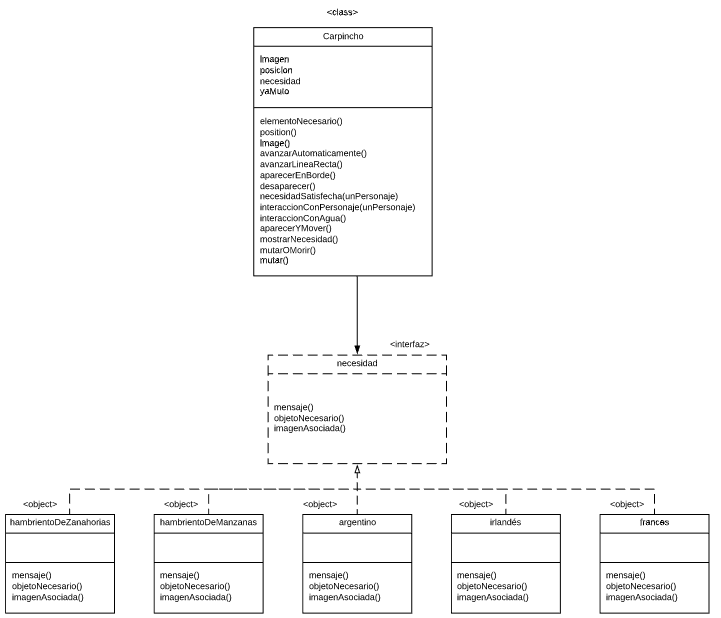

# Nuevo proyecto
Inserte la descripción de su proyecto aquí

Diagrama estático:

link de lucidchard: https://lucid.app/invitations/accept/d8815923-051e-42ed-9a63-40dc61db71d7

Polimorfismo: ¿Cuál es el mensaje polimórfico? ¿Qué objetos lo implementan? ¿Qué objeto se aprovecha de ello?

Usamos varias veces polimorfismo, una de los mensajes con esta caracteristica es interaccionConPersonaje(personaje). Lo implementan Carpincho, Personaje. 

La ventaja está en que se pueden agregar distintos objetos al tablero y de esta forma podemos definirle un comportamiento distinto por cada objeto agregado sin modificar absolutamente nada del código, sólo hay que agregar un objeto o clase que implemente el método interaccionConPersonaje(personaje).

Colecciones: ¿Qué operaciones de colecciones se utilizan? ¿Usaron mensajes con y sin efecto? ¿Para qué?

Lo utilizamos para guardar los elementos que toma el personaje en inventario, las operaciones son :
    - size()
    - isEmpty()
    - contains()
    - add()
    - remove()
    - find()
  
Aplicamos mensajes con y sin efecto, los mensajes con efecto los empleamos para remover y agregar elementos de la colección, y los otros mensajes para obtener información de la misma.

Clases: ¿Usan clases? ¿Por qué? ¿Dónde o cuándo se instancian los objetos?

Usamos una clase para Carpincho ya que necesitamos muchas instancias de esta clase. Estos objetos los intanciamos cuando 
generamos los carpinchos cada un determinado tiempo y les definimos su comportamiento. Los instanciamos  en juego.wlk en el metodo generarUnCarpinchoYMoverEnLineaRecta().

Herencia: ¿Entre quiénes y por qué? ¿Qué comportamiento es común y cuál distinto?

Utilizamos herencia para los distintos elementos que se encuentran en el tablero, si bien cada uno tiene su propia imagen y posición todos tienen que poder responder de igual forma con el mensaje interaccionConPersonaje(persona), de esta forma evitamos repetir codigo. 

Composición: ¿Qué objetos interactúan? ¿Dónde se delega? ¿Por qué no herencia?

Hicimos uso del concepto de composición para vincular la clase carpincho (cada una de sus instancias) con las necesidades (modeladas con objetos). La delegación se da cuando un carpincho debe responder al mensaje mostrarNecesidad (en la implementación del método que lleva el mismo nombre).

